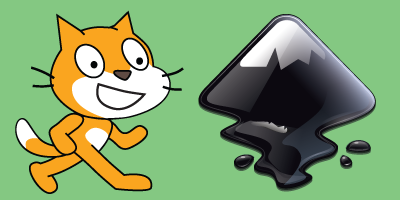

# Bienvenid@s

Sitio web de recursos para 2A de informática, sobre ilustración digital y animación empleando las herramientas [Inkscape](https://inkscape.org/es/) y [Scratch](https://scratch.mit.edu/). 

**Prof. Raúl Jesús López** 

**Telegram** 
<i class="fa fa-telegram" aria-hidden="true"></i>&nbsp;&nbsp;[t.me/rauljesus](https://t.me/rauljesus) 

_Podés descargar Telegram desde [Play Store](https://play.google.com/store/apps/details?id=org.telegram.messenger&hl=es_419) o [App Store](https://itunes.apple.com/ar/app/telegram-messenger/id686449807?mt=8)_ 

**Correo Electrónico** 
<i class="fa fa-envelope" aria-hidden="true"></i>&nbsp;&nbsp;profesor<i class="fa fa-at"></i>rauljesus.xyz 
